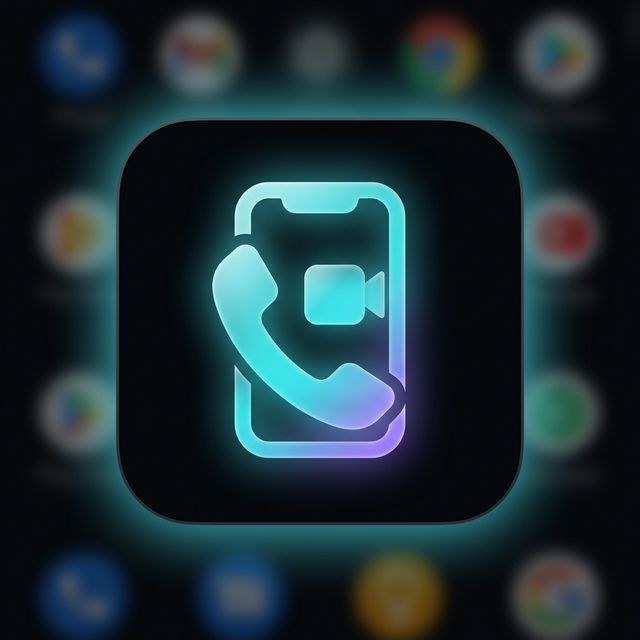

<p align="center">
  
</p>

<h1 align="center">NexCall — Secure Video Calling</h1>

<p align="center">
  End-to-end encrypted 1-to-1 video calling powered by WebRTC, Express & Socket.io
</p>

<p align="center">
  
  
  
  
  
</p>

---

## ✨ Features

| Feature | Description |
|---------|-------------|
| 🔒 **E2E Encrypted** | WebRTC peer-to-peer — media never touches the server |
| 📱 **PWA + Android** | Install as PWA or build native APK via Capacitor |
| 💬 **In-call Chat** | Real-time text chat alongside video |
| 🖥️ **Screen Share** | One-click screen sharing |
| 🛡️ **Security** | HTTPS, JWT auth, rate limiting, Helmet headers |
| 🎨 **Premium UI** | Glassmorphism dark theme, smooth animations |

---

## 🚀 Quick Start

```bash
# 1. Clone & install
git clone https://github.com/YOUR_USERNAME/nexcall.git
cd nexcall
npm install

# 2. Generate self-signed SSL certs (for local dev)
npm run gen-certs

# 3. Start the server
npm start
# → https://localhost:3000
```

---

## 📁 Project Structure

```
nexcall/
├── .github/workflows/     # CI/CD pipelines
│   ├── ci.yml             # Build validation + Android APK
│   ├── deploy.yml         # Auto-deploy to Render
│   └── release.yml        # Tagged release with APK
├── android/               # Capacitor Android project
├── icons/                 # PWA icons (192×192, 512×512)
├── www/                   # Capacitor web assets
├── index.html             # Full frontend (HTML + CSS + JS)
├── server.js              # Express + Socket.io signaling server
├── sw.js                  # Service worker (offline cache)
├── manifest.json          # PWA manifest
├── capacitor.config.json  # Capacitor config
├── Procfile               # Cloud deployment entry point
└── package.json
```

---

## ☁️ Deploy to Cloud

### Render (Recommended — Free Tier)

1. Push this repo to GitHub
2. Go to [render.com](https://render.com) → **New Web Service**
3. Connect your GitHub repo
4. Set these values:
   - **Build Command**: `npm install`
   - **Start Command**: `node server.js`
   - **Environment Variables**:
     ```
     USE_HTTPS=false
     PORT=10000
     JWT_SECRET=your-strong-secret-here
     ALLOWED_ORIGIN=https://your-app.onrender.com
     ```
5. Deploy! 🚀

The `deploy.yml` GitHub Action will auto-redeploy on every push to `main`.

---

## 📱 Build Android APK

### Locally
```bash
npx cap sync android
cd android
./gradlew assembleDebug
# APK → android/app/build/outputs/apk/debug/
```

### Via GitHub Actions (Automatic)
Every push to `main` triggers the CI workflow which builds the APK.  
Download it from **Actions → CI → Artifacts → nexcall-debug-apk**.

### Release APK
```bash
git tag v1.0.0
git push origin v1.0.0
# → GitHub Actions builds & attaches APK to the Release page
```

---

## 🔧 Environment Variables

| Variable | Default | Description |
|----------|---------|-------------|
| `PORT` | `3000` | Server port |
| `USE_HTTPS` | `true` | Set `false` on cloud platforms |
| `JWT_SECRET` | auto-generated | Set a strong secret in production |
| `ALLOWED_ORIGIN` | `https://localhost:3000` | CORS allowed origin |

---

## 🤝 Contributing

1. Fork the repo
2. Create a feature branch (`git checkout -b feature/amazing`)
3. Commit changes (`git commit -m 'Add amazing feature'`)
4. Push to branch (`git push origin feature/amazing`)
5. Open a Pull Request

---

## 📄 License

[MIT](LICENSE) — Free to use, modify, and distribute.
